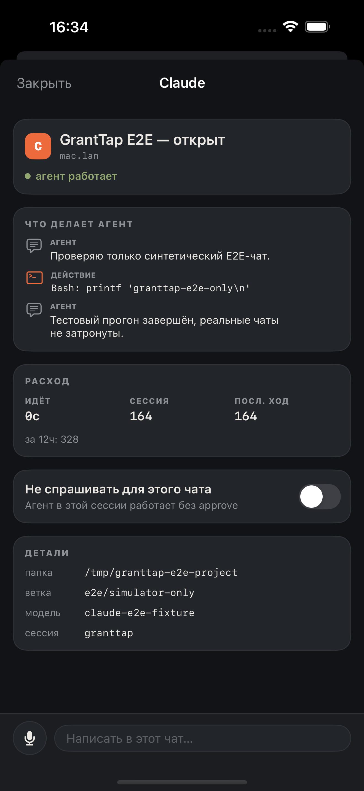
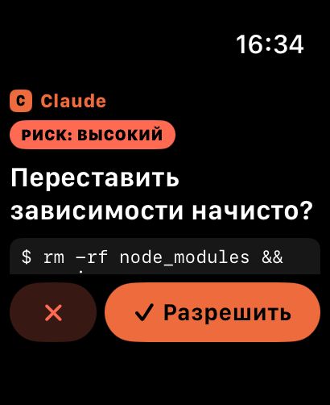

# GrantTap MCP

[](https://www.npmjs.com/package/granttap-mcp)
[](LICENSE)

The public, auditable machine-side bridge for [GrantTap](https://granttap.com):
ask a person, send a status update, or request an approval on their iPhone or
Apple Watch without sending agent traffic through a model proxy.

GrantTap MCP complements the agents' native permission hooks:

- MCP is the voluntary channel: the agent calls `ask`, `ask_yes_no`, or `notify`.
- Hooks are the mandatory approval channel: Claude Code or Codex pauses before
  a tool call and waits for Allow or Deny.
- Both channels use the same end-to-end encrypted GrantTap pairing.

| Visible iPhone activity | Approval on Apple Watch |
| --- | --- |
|  |  |

The iPhone and Apple Watch app is preparing for App Store release. Current
status and target date are published at [granttap.com](https://granttap.com).
Support, privacy, terms, and license information are linked below and from the
app's About screen.

## Install

Register the MCP server once:

```bash
codex mcp add granttap -- npx -y granttap-mcp
claude mcp add granttap -- npx -y granttap-mcp
```

Then start a fresh chat and say **“Connect GrantTap.”** The `connect` tool
creates the E2EE pairing, registers the approval hooks, and returns a scannable
one-time QR directly in the chat. No terminal QR or copied pairing JSON is
needed. Pairing hand-off v2 parks ciphertext under a random mailbox id while an
independent 256-bit key stays only in the QR/manual token. Cloudflare never
receives that key; persistent device keys stay out of the chat transcript.

The same MCP process also publishes recent Codex and Claude Code tasks to the
phone. Sending from the home screen can create a new task in either agent;
opening a task and replying continues that exact task. Photos, camera images,
and documents are encrypted with the message and delivered as local agent
inputs, with up to five attachments selected together. No separate monitor
command is required. Task cards expose the latest human-readable agent update,
while the five newest visible events and full formatted activity stay inside
the selected task.

Phone-originated messages have stable random ids. The Mac records each id
before launching an agent turn, rejects duplicate retries, and returns an
encrypted accepted/rejected receipt. The iPhone shows queued, sending,
delivered, or failed state and retries temporary failures with bounded backoff;
the relay retains an envelope until the receiver confirms successful
decryption. A socket write alone is never shown as delivered.

Task detail distinguishes usage tokens from the agent's active context, reports
the model context window when the agent exposes it, and can invoke Codex's real
app-server context compaction for an idle task. Claude Code currently has no
supported remote compaction command, so the bridge reports that limitation
instead of sending a prompt that only pretends to compact.

Configured MCP servers are published to the phone and can be allowed or denied
per task. The choice is enforced on later turns delivered by GrantTap and never
re-enables a globally disabled server. Repository-scoped skills found under
`.agents/skills` or `.claude/skills` can be selected explicitly for the next
turn. For Codex tasks, the phone can also choose read-only, workspace, or full
filesystem access for that turn.

GrantTap's phone-managed local scheduler can create, edit, enable, delete, and
run recurring Codex or Claude Code tasks using standard five-field cron in the
Mac's timezone. Codex runs the user's configured OpenAI model. These schedules
are intentionally separate from private/native ChatGPT Scheduled Tasks, Codex
Automations, and Claude Routines rather than pretending to mutate an
unpublished provider API. On macOS, pairing installs a per-user `launchd`
helper so task sync and local schedules remain available without an open
terminal and without reopening agent chats that predate the MCP installation.
Every automatic or manual run is persisted locally with start/end time, agent,
status, result, and created session id; the phone can inspect this history.

New pairings also generate a separate random room credential for authenticated
APNs token registration. It is not an E2EE key and reveals no payload. The
public relay uses it only to protect the device-token record; notification
content remains generic while the real task envelope stays encrypted.

The CLI remains available as a fallback for clients that cannot display MCP
image content:

```bash
npm install -g granttap-mcp
granttap-mcp connect
granttap-mcp setup
```

CLI `connect` prints a one-time QR and eight-character code. It uses
the production zero-knowledge relay by default; pass your own `wss://` URL as
the first argument to self-host. The pairing lives locally in
`~/.granttap/machine.json`; this package never uploads the device secret key.
Existing beta installations using `~/.nodvox/` are migrated automatically.

`connect` also registers both hooks. `setup` is an idempotent standalone
command for upgrades: it preserves unrelated settings and writes a backup
before changing a configuration file.

## MCP tools

| Tool | Result |
| --- | --- |
| `connect` | Creates a pairing and returns a secure one-time QR directly in chat |
| `ask` | Sends an open question and waits for a spoken or typed reply |
| `ask_yes_no` | Sends a yes/no question and waits for a tap |
| `notify` | Sends a non-blocking status message |
| `setup` | Registers agent approval hooks and terminal-free background task sync |

## CLI commands

| Command | Purpose |
| --- | --- |
| *(no command)* | Starts the GrantTap MCP stdio server |
| `connect [relayUrl]` | Fallback: creates an E2EE pairing and prints a one-time QR/secure token |
| `setup` | Registers the Claude Code and Codex approval hooks |

The default answer timeout is three minutes. Override it with
`GRANTTAP_ASK_TIMEOUT_MS`.

## Security model

Message payloads are authenticated and encrypted locally with NaCl
public-key boxes. The relay receives only routing metadata and opaque
ciphertext. It has no device secret key and cannot decrypt questions,
commands, replies, or approvals.

Pairing uses independent mailbox and transfer-key values; the transfer key is
never sent to the relay. Attached tasks also receive independent random keys,
so disclosure of one task key cannot open another task. See [SECURITY.md](SECURITY.md)
for the exact guarantees, observable metadata, and endpoint-compromise limit.

This repository intentionally includes the protocol, crypto client, relay
client, MCP server, and agent hook adapters so that the complete public
machine-side trust boundary can be reviewed.

The relay still observes metadata such as room identifiers, IP addresses,
timing, and message sizes. Review or self-host the public
[GrantTap relay](https://github.com/sergii-ziborov/granttap-relay) if that
metadata matters to your deployment.

## Development

Requires Node.js 20 or newer.

```bash
git clone https://github.com/sergii-ziborov/granttap-mcp.git
cd granttap-mcp
npm install
npm test
npm run typecheck
```

Start the stdio server with `npm start`. Run `npm run setup` only on a machine
where you want the hooks installed; existing config files are backed up once
as `*.bak-granttap`.

## Related

- Product: [granttap.com](https://granttap.com)
- npm: [granttap-mcp](https://www.npmjs.com/package/granttap-mcp)
- Relay: [sergii-ziborov/granttap-relay](https://github.com/sergii-ziborov/granttap-relay)
- Privacy: [granttap.com/privacy](https://granttap.com/privacy)
- Support: [granttap.com/support](https://granttap.com/support)
- Security policy: [SECURITY.md](SECURITY.md)

GrantTap is not affiliated with Anthropic or OpenAI.
