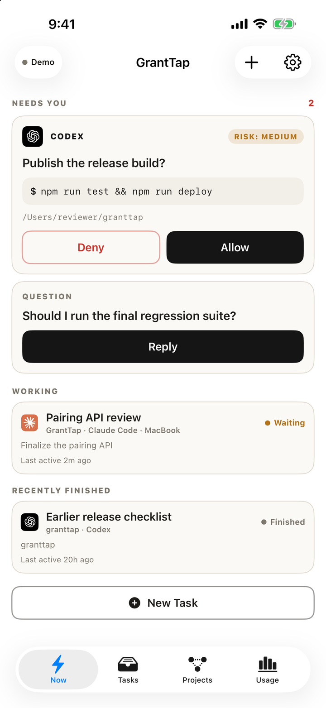
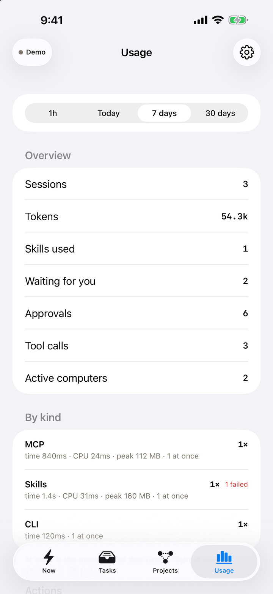
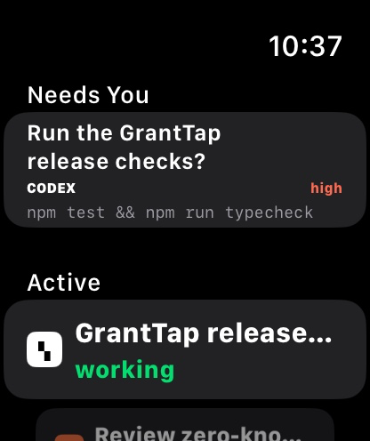
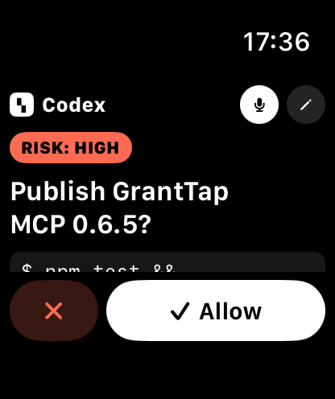

# GrantTap MCP

[](https://www.npmjs.com/package/granttap-mcp)
[](https://github.com/sergii-ziborov/granttap-mcp/actions/workflows/ci.yml)
[](LICENSE)

GrantTap is a Personal live control center for local coding agents.

> See what your coding agents are doing. Step in when they need you.

This repository is the canonical machine runtime: CLI, MCP server, provider
hooks, local adapters, and TypeScript wire schemas. Agents and provider
credentials stay on your computer. Native iPhone and Apple Watch traffic is
end-to-end encrypted.

The source is public for inspection and contribution, but GrantTap MCP is
proprietary paid software rather than open source. Production use requires an
active GrantTap subscription or a separate commercial agreement.

[Website](https://granttap.com) · [npm](https://www.npmjs.com/package/granttap-mcp) ·
[Security model](SECURITY.md) ·
[Relay source](https://github.com/sergii-ziborov/granttap-relay)

## iPhone and Apple Watch

<p align="center">
  
  
  
</p>

<p align="center">
  
  
</p>

## Supported providers

- Primary: Claude Code and Codex.
- Beta: Cursor.
- Experimental where available: Grok Build.

GrantTap reports the depth each provider actually exposes. Visibility does not
imply deterministic remote blocking or full mobile continuation.

## Project Mesh and task handoff

Project Mesh adds stable Project and Task identity above provider-native
sessions. A Task can retain its `taskId` across multiple executions, agents,
and computers while each native session remains intact.

Agents publish bounded progress, dependency, question, answer, claim, conflict,
and completion events through the existing `notify` tool, and read state from a
Mesh resource. Full transcripts and hidden reasoning are never mesh payloads.
Claims have TTLs; a colliding claim is rejected before it is recorded so agents
can choose different work or contact the owner before escalating to Needs You.

For Claude Code, Codex, and Cursor, the provider hook runs inside the agent's
own session and sees the exact call. GrantTap attributes every `notify` to the
session that really made it and publishes the event only for that execution —
a model that learned another session's id cannot act in its name.
`granttap://mesh/current` therefore carries no Project data: an attributed call returns this execution's opaque
`granttap://mesh/<capability>` URI, and only that URI serves its Project, Task,
owners, claims, dependencies, and relevant events. Ownership transfer stays out
of the tool surface entirely: `HANDOFF_ACCEPTED` and `HANDOFF_REJECTED` are
decided by the runtime after receipt verification.

The first executable handoff path is Claude Code ↔ Codex across linked
computers. GrantTap builds a bounded Task Capsule from explicit task/git facts,
requires local phone authorization, creates a separate target branch/worktree,
starts the target execution, and returns a receipt bound to the exact capsule.
Cursor uses the same provider-neutral schema and trusted caller attribution.
Grok Build remains Experimental and observable where available, but does not
yet expose a trusted caller hook, so agent-authored scoped Mesh events are not
offered for it. Unsupported remote-start paths fail closed instead of claiming
parity.

A capsule carries facts, not files. A handoff from a checkout with uncommitted
changes is refused — "This task has uncommitted changes. Commit or checkpoint
them before moving the task." — instead of silently continuing the Task from
committed state and leaving that work behind. Asked to checkpoint from the
phone, the source computer commits everything to `granttap/checkpoint/<task>`
from a temporary index, so HEAD, the current branch, and the working tree stay
exactly as the agent left them, and the capsule carries that commit. Nothing is
pushed; the destination says so if the commit has not reached it.

Claims do not wait for an agent to announce them. Every edit an agent makes is
visible in its transcript, so the runtime derives an intent claim from each
recent write — marked as seen rather than said, and expiring ten minutes after
the writing stops. Overlap is judged twice: the same file is a conflict, and
the same module is the warning that comes before it. A module is recognised
from the path alone, so every computer and the phone reach the same answer,
and the Task screen names who else is in this Task's files or modules while it
can still be avoided. The destination is refused just
as explicitly when the named commit is not on its computer, or when the
capsule's own resource claims overlap another execution's; GrantTap never
pushes or fetches on its own.

A Project usually binds more than one repository, and a bound repository can
say which of the others sit on the far side of its databases, topics, and APIs:
commit a [`WEAVATRIX.md`](https://github.com/Weavatrix/weavatrix-md) next to the
README and the runtime reads it — only the edges it states, nothing inferred —
and publishes them with the Project. The Task screen then names another Task
that is working on the other side of a contract this Task touches (the consumer
of a topic it produces, the caller of an API it changes), and the scoped
`granttap://mesh/{capability}` resource gives the agent the same `peers`,
`otherSide`, and `neighbours` so it can coordinate before it commits.

### Grok Bot as a scoped Mesh participant

Grok Bot is a persistent agent, not a coding-agent integration. The iPhone
issues a one-time encrypted Mesh Invite scoped to the Projects you select, and
the invite is redeemed on the trusted CLI:

```bash
granttap mesh connect <one-time-invite>
```

Grok Bot then runs `granttap internal mesh-mcp`, a separate scoped MCP server
that exposes only the twelve task-scoped Mesh operations. It cannot create
invites, change the relay, expand Project scope, or reach `setup`; revoking the
endpoint from the iPhone stops new Mesh operations immediately while local Task
history stays on the device.

## Install

Installation and production use require Authorized Access under the
[GrantTap Commercial Source License](LICENSE).

```bash
npm install -g granttap-mcp
granttap setup
```

`granttap setup` detects supported local agents, installs or repairs their
hooks, installs the background helper, configures Cursor's persistent local
OAuth service when Cursor is present, and starts phone pairing when run in an
interactive terminal. It ends with one exact next action.

Setup also declares the separately distributed GrantTap Engine, which Project
Governance needs before it can report anything. The standard locations are
searched, and `--engine <path>` points at one that lives elsewhere; the binary
is checksummed here, because that checksum is the only thing verified before it
is launched. Without an engine the rollout stays off and setup says so, rather
than leaving "Governance not reported" on the phone as the only symptom.

The normal CLI surface is intentionally small:

```text
granttap setup [--engine <path>]
granttap status [--json]
granttap connect [--relay <wss-url>]
granttap reset [--yes]
granttap mesh connect <one-time-invite>
```

`connect` reuses a valid pairing. If none exists, it creates a one-time QR.
Custom relays are CLI-only and explicit. `reset` moves active pairing files to
recoverable local backups before a new pairing can be created.

Cursor setup is automatic in the normal flow. The advanced repair command is:

```bash
granttap cursor repair
```

After Codex hooks are installed, open `/hooks`, review and trust both exact
GrantTap hooks, then restart Codex. GrantTap never treats installation as user
trust.

## MCP contract

`tools/list` returns exactly four public tools:

| Tool | Contract |
| --- | --- |
| `connect` | Reuse the existing production pairing or return a one-time QR |
| `notify` | Send a non-blocking status update of at most 2,000 characters |
| `ask_yes_no` | Ask a yes/no question and wait for the explicit answer |
| `ask` | Ask an open question and wait for typed or spoken text |

MCP `connect` accepts no custom routing, replacement, or key-rotation input.
Setup is CLI-only because it changes provider configuration and must not be
available to a model through prompt injection.

`notify` may alternatively carry one bounded task-scoped Mesh event. This does
not add a fifth MCP tool or grant any global setup capability, and it publishes
only for the execution whose provider hook attributed the call.

Provider-native approvals and mobile continuation require the matching local
adapter. MCP registration alone is never reported as proof that an integration
is ready.

## What the runtime publishes

The bounded encrypted protocol preserves:

- provider, task, computer, model, workspace, branch, state, and summary;
- visible activity, delivery state, context and token counters;
- MCP, Skill, and CLI observations;
- child-agent relationships;
- per-capability outcome: `success`, `error`, `cancelled`, or `unknown`;
- what a call cost, where the machine can be observed while it ran.

An optional bounded `errorClass` may describe an error category. Full tool
error payloads are not copied into usage telemetry by default.

### One computer, whatever the network calls it

The Mesh keys a computer by an identity written down once, on first use, in
`computer.json` in the config directory — the hostname it had then — and
keeps it. A Mac renamed by the network it joins ("Mac.lan" at home,
"Serhiis-MacBook-Pro.local" elsewhere) used to become a second computer with
its own open executions and repository bindings; now every later hostname is
remembered as a former name of the same machine, its leftover executions are
closed and its bindings marked unavailable, and the current hostname stays
what people see. `GRANTTAP_COMPUTER_ID` overrides the stored id.

### Run journal and prompt-time context

A message from the phone is answered by a fresh `claude -p --resume` of the
same chat. Its turns land in the transcript, but a session holding that chat
open never sees them — its context was built before they happened. The runtime
therefore journals every delivery: what was asked (without the attachment
note), what came back, which files were written, how many tool calls it took,
and whether the run was cut off by the ten-minute delivery limit. The Task
carries the same digest as `TASK_PROGRESS`, so the phone's timeline and the
Mesh show it. A `UserPromptSubmit` hook, installed beside the approval hook by
`granttap setup`, adds the unread journal to the next prompt of the live
session together with the Mesh brief — the other live Tasks in the Project,
who is in the same file or module, the other side of the repository, and any
question still unanswered — and names the MCP resource
`granttap://mesh/{capability}/map`, one page of markdown with the whole
Project: Tasks, who edits which module, the other side of each repository,
dependencies, and what just happened. Background runs themselves receive
nothing from the hook; the journal is kept for the session a person is in.

### Tool versions and updates from the phone

The status also names each provider's command-line tool as it answers on this
computer — its version, how it is kept current, and, for Claude Code, whether a
newer copy already sits on the disk (the Claude desktop app keeps its own; the
runtime uses the newest one it finds). A tool that lags the rest of the
environment fails in ways the phone can only report, so the phone can ask this
computer to update one: the phone names only the tool, and the command is the
runtime's, fixed by how the tool was installed — `claude update`, `agent
update`, `grok update`, the npm that owns the tool's prefix, or Homebrew. The
runtime never downloads a tool itself; a tool installed by an installer script
is left to a trusted terminal, with the command spelled out in the answer. The
result — version before and after, the updater's own output — comes back as
`tool.update.result`.

Cost is reported as attributed rather than measured, because that is what it
is. A call is read back from the transcript once it has finished, so it can
never be measured directly: an MCP server outlives its calls and is sampled
directly, while a built-in tool leaves nothing behind and is costed from the
samples that fall inside its own start and end. A call with no sample near it
reports nothing rather than a number borrowed from another moment.

## Local enforcement

GrantTap can narrow later actions for an exact task only where a provider
offers a deterministic local hook. Global provider configuration always wins.
Read-only integrations stay read-only in the app instead of presenting a fake
toggle.

The user-facing approval modes map to the existing runtime policy:

| Personal UI | Runtime |
| --- | --- |
| Ask for risky actions | `except_push` |
| Ask for every action | `ask` |
| Use agent defaults | no GrantTap gate for that task |

Legacy custom levels remain compatible but are not part of the primary flow.

## Project Governance

Capabilities are decided per Project, not per task. A policy names an effect —
`allow`, `ask`, or `deny` — for each kind (skills, MCP servers, shell and
scripts, file writes, deploy, network), and may name one capability alone: one
MCP server can be forbidden without forbidding every server. A named rule wins
over its kind, and a global deny always wins over a Project.

The phone authors the policy and hands it to every Project computer through the
relay, which holds the encrypted packet until each computer reads its mailbox;
a computer that was asleep receives it when it returns. Each computer applies
the policy through the GrantTap Engine, acknowledges the revision it enforces,
and reports coverage — enforced, observed only, unsupported, or unknown — per
capability kind, so the phone shows what is actually in force rather than what
was sent. Revision zero is a Project with no policy yet, and it is reported so
the first policy can be written.

Evaluation happens in the provider hook before the action runs, with a deadline
long enough for a busy machine to answer. A missed answer falls back to the
legacy GrantTap gate rather than to a silent allow, and content never crosses
to the engine: it receives a capability fingerprint, not the command or file.

A refusal is said where the action was. Each one is written down for its chat,
and the timeline carries it as a status row naming the rule and the reason,
beside the call it stopped. On the phone a rule is written where the need for
it appears: touch and hold a tool on the Project page, or use the Governance
menu on a tool's call history, to allow, ask, or deny it for the Project.

## Relay boundary

Pairing and task keys are generated locally. The relay receives opaque routing
metadata and ciphertext, not provider credentials or task plaintext. Pairing
handoff uses a relay-visible random mailbox ID plus an independent transfer key
that stays in the QR.

APNs carries a content-neutral wake only. It contains no prompt, task title,
command, path, request ID, or ciphertext. See [SECURITY.md](SECURITY.md) for the
complete boundary and reporting instructions.

## Development

```bash
npm install
npm run typecheck
npm test
npm run package:allowlist
npm run test:coverage   # macOS only — see below
```

`npm test` runs everywhere. Both suites run with an isolated `HOME`, so a
developer's own Claude/Codex/Cursor data can never inflate a local result: the
numbers on this machine and in CI are the same. The coverage contract is
measured on macOS because the background helper, the Cursor OAuth service, and
the installer only execute there, so a Linux percentage understates real
runtime coverage. CI runs the cross-platform suite on Linux and the coverage
gate on macOS, and `npm publish` enforces the same gate through
`prepublishOnly`.

Do not publish from a dirty checkout or before the package allowlist, tests,
typecheck, and release checks pass.

## License

GrantTap MCP is distributed under the proprietary
[GrantTap Commercial Source License 1.0](LICENSE). Public source access does not
grant open-source, redistribution, hosted-service, or competing-product rights.
Third-party dependencies retain their own terms; see
[THIRD_PARTY_NOTICES.md](THIRD_PARTY_NOTICES.md).

GrantTap is not affiliated with Anthropic, OpenAI, Apple, Anysphere, or xAI.
