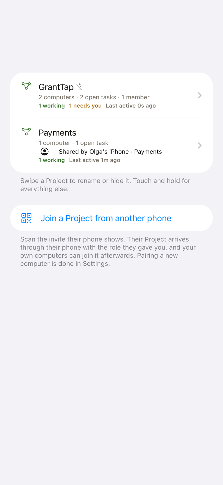
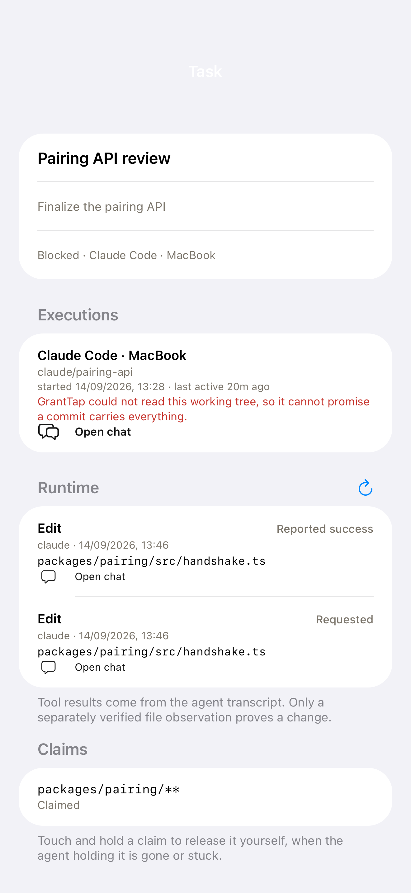
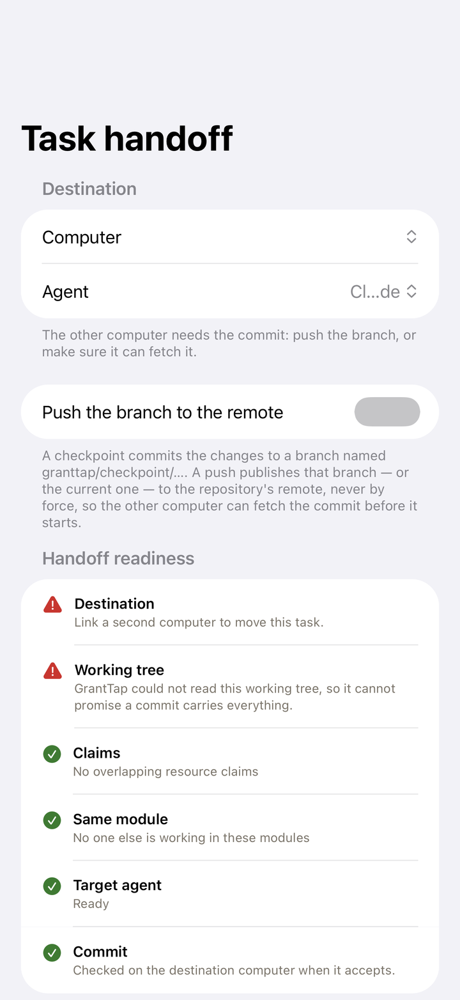
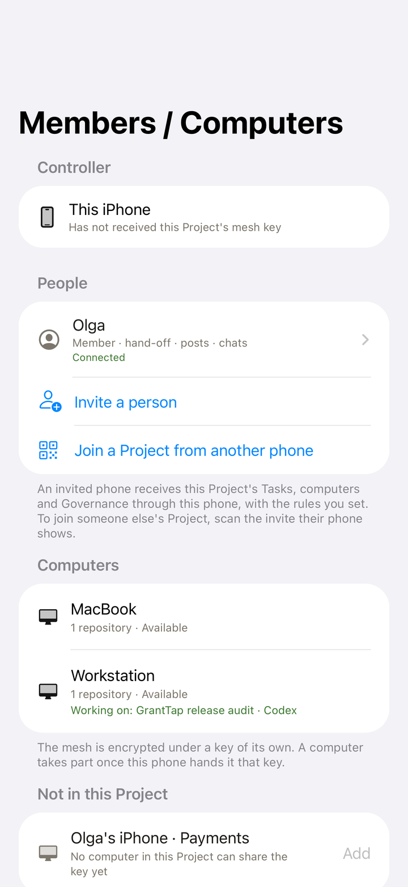
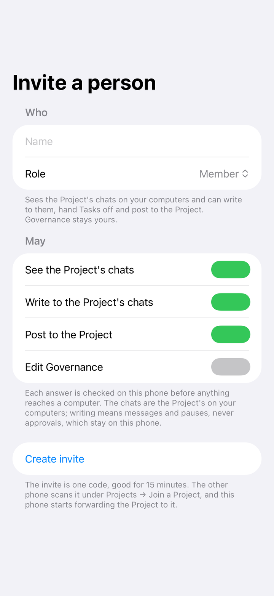
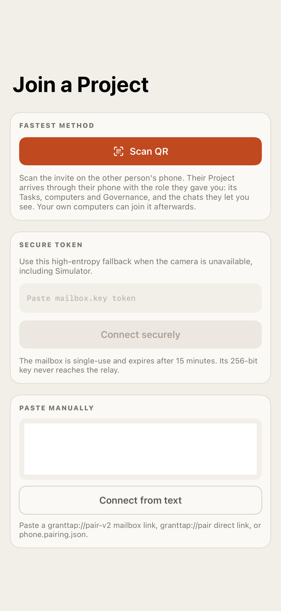
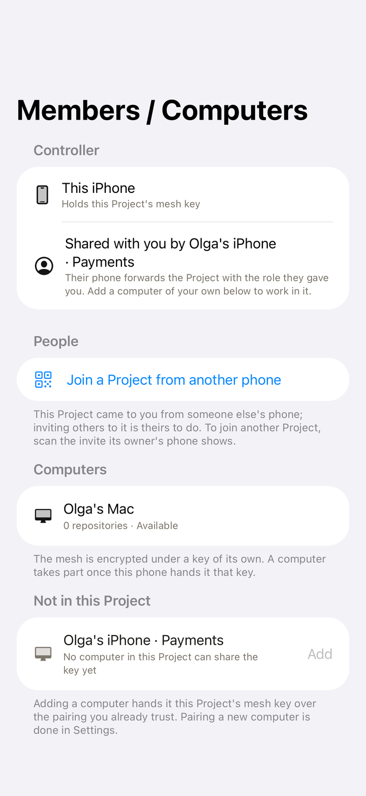
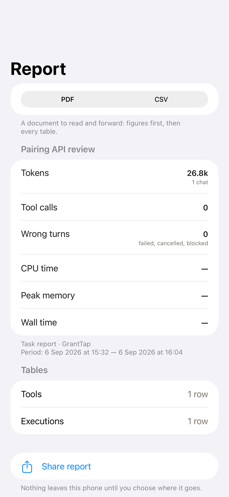
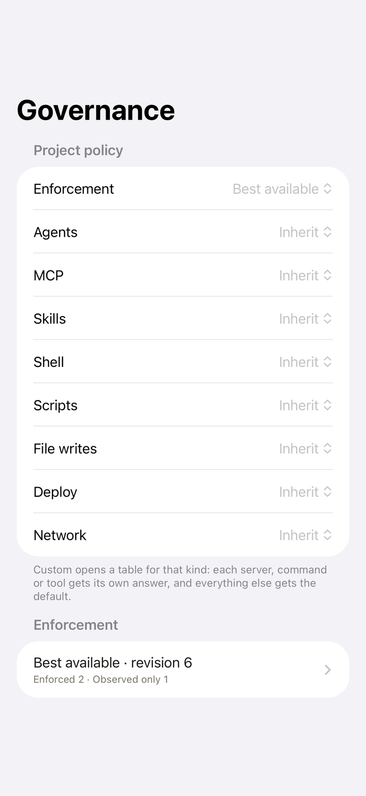
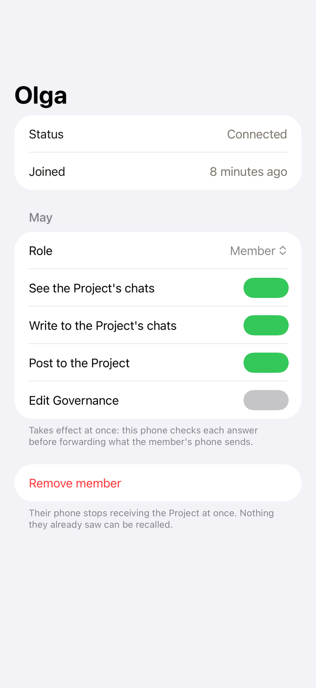

# GrantTap MCP

[](https://www.npmjs.com/package/granttap-mcp)
[](https://github.com/sergii-ziborov/granttap-mcp/actions/workflows/ci.yml)
[](LICENSE)

GrantTap is a Personal live control center for local coding agents.

> See what your coding agents are doing. Step in when they need you.

This repository is the canonical machine runtime: CLI, MCP server, provider
hooks, local adapters, and TypeScript wire schemas. Agents and provider
credentials stay on your computer. Native iPhone and Apple Watch traffic is
end-to-end encrypted.

The MCP runtime, plugins, and CLI are open source under the MIT License. The
iPhone and Apple Watch app is a separate, proprietary product; use of GrantTap's
hosted service is governed by its own terms.

[Website](https://granttap.com) · [npm](https://www.npmjs.com/package/granttap-mcp) ·
[Security model](SECURITY.md) ·
[Relay source](https://github.com/sergii-ziborov/granttap-relay)

## iPhone and Apple Watch

<p align="center">
  
  
  
</p>

<p align="center">
  
  
</p>

## Supported providers

- Primary: Claude Code and Codex.
- Beta: Cursor.
- Experimental where available: Grok Build.

GrantTap reports the depth each provider actually exposes. Visibility does not
imply deterministic remote blocking or full mobile continuation.

## Project Mesh and task handoff

Project Mesh adds stable Project and Task identity above provider-native
sessions. A Task can retain its `taskId` across multiple executions, agents,
and computers while each native session remains intact.

Agents publish bounded progress, dependency, question, answer, claim, conflict,
and completion events through the existing `notify` tool, and read state from a
Mesh resource. Full transcripts and hidden reasoning are never mesh payloads.
Claims have TTLs; a colliding claim is rejected before it is recorded so agents
can choose different work or contact the owner before escalating to Needs You.
Observed edit-tool requests are intent claims, not confirmed writes. Resource
identity includes the repository; equal relative paths from separate repositories
do not conflict, and another checkout is a coordination warning. The path
matcher respects segment boundaries, so `src/auth.ts` and `src/auth.ts.bak`
are distinct. A live repository reading refreshes HEAD after commit or checkout.

When a separately distributed, verified GrantTap Engine is enabled on the
computer, the bridge sends content-free Invocation events before its small Usage
buffer is trimmed. Claude Code, Codex, and Cursor transcript scanners record
native call identity, request, reported outcome, resource path, and explicit
source gaps. The Engine owns the durable journal and bounded cursor history;
the phone requests the latest or older page under the Project E2EE key. A
reported successful tool call alone does not prove a filesystem change, and
unavailable Engine history is reported as unavailable.
The bridge does not yet produce verified filesystem-change events or attach
revision-bound impact/consumer links to individual Invocations. It leaves that
evidence unknown instead of treating an edit request or reported success as a
confirmed content change.
Claude Code and Codex denials with native call IDs are recorded as separate,
metadata-only hook events with the applied rule and policy revision; an
unidentified Cursor decision is not assigned to an invented call. Script and
`SKILL.md` fingerprints include a content hash when the local file is readable,
separate from their path identity. Missing content evidence remains unknown.

<p align="center">
  
  
  
  
</p>

<p align="center"><em>Projects, one of them shared by another phone · a Project with its Governance, members, computers, repositories, and Tasks · a Task with executions, Runtime history, and claims · a handoff with its readiness checks</em></p>

For Claude Code, Codex, and Cursor, the provider hook runs inside the agent's
own session and sees the exact call. GrantTap attributes every `notify` to the
session that really made it and publishes the event only for that execution —
a model that learned another session's id cannot act in its name.
`granttap://mesh/current` therefore carries no Project data: an attributed call returns this execution's opaque
`granttap://mesh/<capability>` URI, and only that URI serves its Project, Task,
owners, claims, dependencies, and relevant events. Ownership transfer stays out
of the tool surface entirely: `HANDOFF_ACCEPTED` and `HANDOFF_REJECTED` are
decided by the runtime after receipt verification.

The first executable handoff path is Claude Code ↔ Codex across linked
computers. GrantTap builds a bounded Task Capsule from explicit task/git facts,
requires local phone authorization, creates a separate target branch/worktree,
starts the target execution, and returns a receipt bound to the exact capsule.
Cursor uses the same provider-neutral schema and trusted caller attribution.
Grok Build remains Experimental and observable where available, but does not
yet expose a trusted caller hook, so agent-authored scoped Mesh events are not
offered for it. Unsupported remote-start paths fail closed instead of claiming
parity.

A capsule carries facts, not files. A handoff from a checkout with uncommitted
changes is refused — "This task has uncommitted changes. Commit or checkpoint
them before moving the task." — instead of silently continuing the Task from
committed state and leaving that work behind. Asked to checkpoint from the
phone, the source computer commits everything to `granttap/checkpoint/<task>`
from a temporary index, so HEAD, the current branch, and the working tree stay
exactly as the agent left them, and the capsule carries that commit. Nothing is
pushed unless the phone asks for it per handoff: then the source publishes the
branch the capsule names to the checkout's remote — never by force — before the
capsule leaves, a push that fails blocks the move, and a destination that lacks
the commit fetches that branch once before refusing. A handoff can also stay on
one computer: the same Task continues with another agent there, in a worktree
of its own from the same commit, taken up at once by the computer that
prepared it.

### Pause and resume

A chat can be held from the phone. The hold is enforced where the work
happens: every provider hook refuses every tool call from that chat — the
agent reads "GrantTap paused this chat from the phone" and is told to wait —
and a delivery already running for the chat is stopped. A message sent to a
held chat is refused for the same reason. Resuming lifts the hold; asked to
continue, the computer answers the phone at once and then delivers one
continuation prompt in the background, so "start" is one tap. The hold lives
in the runtime config as `pausedSessions` and is published on the session as
`paused`.

Claims do not wait for an agent to announce them. Every edit an agent makes is
visible in its transcript, so the runtime derives an intent claim from each
recent write — marked as seen rather than said, and expiring ten minutes after
the writing stops. Overlap is judged twice: the same file is a conflict, and
the same module is the warning that comes before it. A module is recognised
from the path alone, so every computer and the phone reach the same answer,
and the Task screen names who else is in this Task's files or modules while it
can still be avoided. The destination is refused just
as explicitly when the named commit is not on its computer, or when the
capsule's own resource claims overlap another execution's; GrantTap never
pushes or fetches on its own.

A Project usually binds more than one repository, and a bound repository can
say which of the others sit on the far side of its databases, topics, and APIs:
commit a [`WEAVATRIX.md`](https://github.com/Weavatrix/weavatrix-md) next to the
README and the runtime reads it — only the edges it states, nothing inferred —
and publishes them with the Project. The Task screen then names another Task
that is working on the other side of a contract this Task touches (the consumer
of a topic it produces, the caller of an API it changes), and the scoped
`granttap://mesh/{capability}` resource gives the agent the same `peers`,
`otherSide`, and `neighbours` so it can coordinate before it commits.

### Members, roles, and computers of their own

A Project is shared from the phone that owns it, and that phone stays the
hub: nothing a member does reaches a computer without passing through it.
*Invite a person* makes a one-time code, good for fifteen minutes; the other
phone scans it under *Projects → Join a Project*, and the Project arrives
there with the role the owner chose — Viewer, Member, or Admin — and the four
answers under it: see the Project's chats, write to them, post to the
Project, edit Governance. Each answer is checked on the owner's phone before
a message, a pause, a handoff, or a release is forwarded, and a refusal comes
back to the member's phone as a message of its own, naming the rule. Changing
a role takes effect at once; removing a member stops the forwarding at once,
though nothing already seen can be recalled.

<p align="center">
  
  
  
  
</p>

<p align="center"><em>The owner's members and computers · an invite with its role · joining from another phone · the shared Project as the member sees it, with a computer of their own to add</em></p>

A member works in the Project with computers of their own. Adding one hands
it the Project's mesh key over the pairing the member's phone already trusts,
and from then on that computer takes part in the mesh like any other: its
chats are the Project's, its claims are seen by every other computer, and a
Task can be handed to it.

A Project can pin new tasks to one confirmed computer. The endpoint id is
the stored computer identity, not the display name. Models offered on the
phone come from that host's catalog. If the pinned host is offline, the
Project either refuses the create or queues it until a deadline — it does
not silently start the task elsewhere. A command issued for a previous
instance of the computer (a restore or clone that kept pairing keys) is
rejected. A pin is not a secure VM.

### A claim released by the person

A claim outlives an agent that crashed or was closed, and the files it names
stay fenced off until it expires. Touch and hold a claim on the Task screen
to release it yourself. The phone tells the computer that holds the claim,
and the computer answers with a result of its own: released, or refused with
the reason — no such claim on this computer, a claim that belongs to another
Project, a role that does not allow it, or no computer to ask. A refusal puts
the claim back on the phone with that reason beside it, so what the phone
shows is what the mesh holds. A release is written to the store as a
tombstone, so a snapshot or a late event from a computer that was away cannot
bring the claim back.

### Task reports

<p align="center">
  
</p>

A Task is reported from the phone as a PDF to read and forward, or a CSV with
every table: tokens, tool calls, wrong turns, CPU time, peak memory, and wall
time, by tool and by execution. Nothing leaves the phone until you choose
where it goes.

### Grok Bot as a scoped Mesh participant

Grok Bot is a persistent agent, not a coding-agent integration. The iPhone
issues a one-time encrypted Mesh Invite scoped to the Projects you select, and
the invite is redeemed on the trusted CLI:

```bash
granttap mesh connect <one-time-invite>
```

Grok Bot then runs `granttap internal mesh-mcp`, a separate scoped MCP server
that exposes only the twelve task-scoped Mesh operations. It cannot create
invites, change the relay, expand Project scope, or reach `setup`; revoking the
endpoint from the iPhone stops new Mesh operations immediately while local Task
history stays on the device.

## Install

The local runtime and plugins are available under the [MIT License](LICENSE).
The iPhone and Apple Watch app and hosted service have separate terms.

Install the GrantTap plugin directly from this repository's marketplace:

```bash
# Codex
codex plugin marketplace add sergii-ziborov/granttap-mcp
codex plugin add granttap@granttap

# Claude Code
claude plugin marketplace add sergii-ziborov/granttap-mcp
claude plugin install granttap@granttap

# Grok Build
grok plugin marketplace add sergii-ziborov/granttap-mcp
grok plugin install granttap --trust
```

For Cursor, use the reviewed **GrantTap** Marketplace listing when it is visible
to your account. Reload Cursor. On this computer, run `granttap setup`. Pair
and change settings on [granttap.com/connect](https://granttap.com/connect)
and in the GrantTap app. Authenticate opens that page even when this Mac is
already paired — Approve the coding app, Reconnect, or Add another. A scan in
GrantTap authorizes a new device; a saved pairing does not skip the page.
Do not add GrantTap in Cursor Customize → MCPs. A user HTTP entry at
`http://127.0.0.1:17342/mcp` is why Cloud shows fetch failed.

Open GrantTap from the plugin connection card. Pairing status, a one-time QR
when needed, and confirmed reconnect stay on that card, on
`granttap.com/connect`, and in the GrantTap app. Do not ask an agent to print
a pairing QR in chat. The same tools still return readable MCP content in
clients that do not render app UI. Detailed plugin instructions are in
[`plugins/granttap/README.md`](plugins/granttap/README.md).

For the full background helper and provider hooks, install the CLI and run
setup:

```bash
npm install -g granttap-mcp
granttap setup
```

`granttap setup` detects supported local agents, installs or repairs their
hooks, installs the background helper, removes a leftover user GrantTap MCP
entry when Cursor is present, and starts phone pairing when run in an
interactive terminal. It ends with one exact next action.

Setup also declares the separately distributed GrantTap Engine, which Project
Governance needs before it can report anything. The standard locations are
searched, and `--engine <path>` points at one that lives elsewhere; the binary
is checksummed here, because that checksum is the only thing verified before it
is launched. Without an engine the rollout stays off and setup says so, rather
than leaving "Governance not reported" on the phone as the only symptom.

The normal CLI surface is intentionally small:

```text
granttap setup [--engine <path>]
granttap status [--json]
granttap connect [--relay <wss-url>]
granttap reset [--yes]
granttap mesh connect <one-time-invite>
```

`connect` reuses a valid pairing. If none exists, it creates a one-time QR.
Custom relays are CLI-only and explicit. `reset` moves active pairing files to
recoverable local backups before a new pairing can be created.

Cursor setup is automatic in the normal flow. The advanced repair command is:

```bash
granttap cursor repair
```

After Codex hooks are installed, open `/hooks`, review and trust both exact
GrantTap hooks, then restart Codex. GrantTap never treats installation as user
trust.

## MCP contract

`tools/list` returns exactly five public tools:

| Tool | Contract |
| --- | --- |
| `connect` | Reuse the existing production pairing or return a one-time QR |
| `reconnect` | Replace the pairing after explicit confirmation and return a fresh one-time QR |
| `notify` | Send a non-blocking status update of at most 2,000 characters |
| `ask_yes_no` | Ask a yes/no question and wait for the explicit answer |
| `ask` | Ask an open question and wait for typed or spoken text |

MCP `connect` accepts no custom routing, replacement, or key-rotation input.
`reconnect` is declared destructive and requires `confirmed: true`; relay
acceptance happens before the working local pairing is replaced.
Setup is CLI-only because it changes provider configuration and must not be
available to a model through prompt injection.

`notify` may alternatively carry one bounded task-scoped Mesh event. This does
not add a fifth MCP tool or grant any global setup capability, and it publishes
only for the execution whose provider hook attributed the call.

`notify`, `ask_yes_no`, and `ask` accept an `operationId`. A named call is
remembered for fifteen minutes under the chat that made it, the tool, and the
arguments: a retry returns the answer already given instead of asking again,
a retry that arrives while the first call is still waiting waits for the same
answer, and the same name used for other arguments is refused. One chat's
name is never another's — the ledger is keyed by the execution the provider
hook attributed, and the hook carries the `operationId` with the call.

Provider-native approvals and mobile continuation require the matching local
adapter. MCP registration alone is never reported as proof that an integration
is ready.

## What the runtime publishes

The bounded encrypted protocol preserves:

- provider, task, computer, model, workspace, branch, state, and summary;
- visible activity, delivery state, context and token counters;
- MCP, Skill, and CLI observations;
- child-agent relationships;
- per-capability outcome: `success`, `error`, `cancelled`, or `unknown`;
- what a call cost, where the machine can be observed while it ran.

An optional bounded `errorClass` may describe an error category. Full tool
error payloads are not copied into usage telemetry by default.

A shell call is named by the command it ran — `npm`, `git`, `xcodebuild` —
with the tool that ran it kept beside the name, so the usage screen can say
which tool was slow or failing rather than listing every call as Bash.

Machine load attributes to an agent everything the agent started — its
shells, its node workers, the build a shell ran — found through the process
tree, and names the heaviest kinds of process it runs (`node` ×19, `zsh` ×3)
so the phone can say what an agent is doing, not only that it is. The
executable path and the command line are read separately and joined by pid,
because a path with a space in it (`~/Library/Application Support/Claude/…`)
cannot be recovered from a command line split on whitespace.

The number can be opened. Each agent's sample carries its heaviest forty
processes one by one — pid, name, CPU, memory, and what the process was asked
to do with the executable's own path and any secret removed — and the same
load added up by chat. Claude Code hands every MCP server it starts the chat's
id in `CLAUDE_CODE_SESSION_ID`, and `ps -E` shows a process's environment to
its owner, so an agent's root process is named by its descendants; only that
one variable is read, the answer is remembered for the root's lifetime, and a
root that could not be named is asked about again after a minute. Each agent's
own folders (`~/.claude`, `~/.codex`, `~/.cursor`, `~/.grok`, plus Claude's
CLI cache) are measured with `du` in the background every ten minutes, top-level
child by child, and carried on the sample; a sample never waits for `du`. The
helper log says once in five minutes what each agent weighed, so a wrong
number on the phone can be traced to the computer.

A shell call is fingerprinted for Project policy by the command it runs —
`git`, `rm`, `npm` — so a Project can allow one command and ask about another
instead of deciding about the shell as a whole; a line with no command word
is still plain `Shell`.

### One computer, whatever the network calls it

The Mesh keys a computer by an identity written down once, on first use, in
`computer.json` in the config directory — the hostname it had then — and
keeps it. A Mac renamed by the network it joins ("Mac.lan" at home,
"Serhiis-MacBook-Pro.local" elsewhere) used to become a second computer with
its own open executions and repository bindings; now every later hostname is
remembered as a former name of the same machine, its leftover executions are
closed and its bindings marked unavailable, and the current hostname stays
what people see. `GRANTTAP_COMPUTER_ID` overrides the stored id.

### Run journal and prompt-time context

A message from the phone is answered by a fresh `claude -p --resume` of the
same chat. Its turns land in the transcript, but a session holding that chat
open never sees them — its context was built before they happened. The runtime
therefore journals every delivery: what was asked (without the attachment
note), what came back, which files were written, how many tool calls it took,
and whether the run was cut off by the ten-minute delivery limit. The Task
carries the same digest as `TASK_PROGRESS`, so the phone's timeline and the
Mesh show it. A `UserPromptSubmit` hook, installed beside the approval hook by
`granttap setup`, adds the unread journal to the next prompt of the live
session together with the Mesh brief — the other live Tasks in the Project,
who is in the same file or module, the other side of the repository, and any
question still unanswered — and names the MCP resource `granttap://mesh/map`,
one page of markdown with the whole Project: Tasks, who edits which module,
the other side of each repository, dependencies, and what just happened. That
resource is listed, because Claude Code reads only listed resources, and it is
scoped without a token: Claude Code starts one MCP server per chat and hands
it the chat's id in `CLAUDE_CODE_SESSION_ID`, which nothing said over the
connection can change. `granttap://mesh/current` serves the same chat's scoped
state there. Other providers keep the tokened `granttap://mesh/{capability}`
and `…/map` forms from an attributed `notify`. Background runs themselves
receive nothing from the hook; the journal is kept for the session a person
is in.

### Tool versions and updates from the phone

The status also names each provider's command-line tool as it answers on this
computer — its version, how it is kept current, and, for Claude Code, whether a
newer copy already sits on the disk (the Claude desktop app keeps its own; the
runtime uses the newest one it finds). A tool that lags the rest of the
environment fails in ways the phone can only report, so the phone can ask this
computer to update one: the phone names only the tool, and the command is the
runtime's, fixed by how the tool was installed — `claude update`, `agent
update`, `grok update`, the npm that owns the tool's prefix, or Homebrew. The
runtime never downloads a tool itself; a tool installed by an installer script
is left to a trusted terminal, with the command spelled out in the answer. The
result — version before and after, the updater's own output — comes back as
`tool.update.result`.

Cost is reported as attributed rather than measured, because that is what it
is. A call is read back from the transcript once it has finished, so it can
never be measured directly: an MCP server outlives its calls and is sampled
directly, while a built-in tool leaves nothing behind and is costed from the
samples that fall inside its own start and end. A call with no sample near it
reports nothing rather than a number borrowed from another moment.

## Local enforcement

GrantTap can narrow later actions for an exact task only where a provider
offers a deterministic local hook. Global provider configuration always wins.
Read-only integrations stay read-only in the app instead of presenting a fake
toggle.

The user-facing approval modes map to the existing runtime policy:

| Personal UI | Runtime |
| --- | --- |
| Ask for risky actions | `except_push` |
| Ask for every action | `ask` |
| Use agent defaults | no GrantTap gate for that task |

Legacy custom levels remain compatible but are not part of the primary flow.

## Project Governance

<p align="center">
  
  
</p>

<p align="center"><em>Governance for the whole Project · a member's answers, changed at once</em></p>

Capabilities are decided per Project, not per task. A policy names an effect —
`allow`, `ask`, or `deny` — for each kind (skills, MCP servers, shell and
scripts, file writes, deploy, network), and may name one capability alone: one
MCP server can be forbidden without forbidding every server. A named rule wins
over its kind, and a global deny always wins over a Project.

The phone authors the policy and hands it to every Project computer through the
relay, which holds the encrypted packet until each computer reads its mailbox;
a computer that was asleep receives it when it returns. Each computer applies
the policy through the GrantTap Engine, acknowledges the revision it enforces,
and reports coverage — enforced, observed only, unsupported, or unknown — per
capability kind, so the phone shows what is actually in force rather than what
was sent. Revision zero is a Project with no policy yet, and it is reported so
the first policy can be written.

A refused edit is answered, not swallowed. When a computer cannot apply a
policy — the phone built it on a revision the computer no longer holds, the
engine is not running, the policy is invalid — it sends
`project.policy.rejected` with the reason and the revision it actually holds,
then the policy it holds, so the phone can say what happened, keep the edit,
and offer it again on top of the current revision. The helper log carries the
same line. What the engine leaves null is sent as absent: the phone reads a
status strictly, and a `null` where a field was optional was read as a wrong
value and the whole status dropped.

A shell call is fingerprinted by the command it runs (`git`, `rm`), a deploy or
network call by the phrase that made it one (`git push`, `curl`), so a named
rule can forbid pushing or deleting while the rest of the shell stays allowed.
A commit or pull request whose command carries a co-author or "generated with"
trailer is fingerprinted as `co-authorship`, its own row in the phone's Shell
table, so a Project whose history is authored by people can deny the trailer
and leave git alone.

Evaluation happens in the provider hook before the action runs, with a deadline
long enough for a busy machine to answer. A missed answer falls back to the
legacy GrantTap gate rather than to a silent allow, and content never crosses
to the engine: it receives a capability fingerprint, not the command or file.

A refusal is said where the action was. Each one is written down for its chat,
and the timeline carries it as a status row naming the rule and the reason,
beside the call it stopped. On the phone a rule is written where the need for
it appears: touch and hold a tool on the Project page, or use the Governance
menu on a tool's call history, to allow, ask, or deny it for the Project.

## Relay boundary

Pairing and task keys are generated locally. The relay receives opaque routing
metadata and ciphertext, not provider credentials or task plaintext. Pairing
handoff uses a relay-visible random mailbox ID plus an independent transfer key
that stays in the QR.

APNs carries a content-neutral wake only. It contains no prompt, task title,
command, path, request ID, or ciphertext. See [SECURITY.md](SECURITY.md) for the
complete boundary and reporting instructions.

## Development

```bash
npm install
npm run typecheck
npm test
npm run package:allowlist
npm run test:coverage   # macOS only — see below
```

`npm test` runs everywhere. Both suites run with an isolated `HOME`, so a
developer's own Claude/Codex/Cursor data can never inflate a local result: the
numbers on this machine and in CI are the same. The coverage contract is
measured on macOS because the background helper, the Cursor OAuth service, and
the installer only execute there, so a Linux percentage understates real
runtime coverage. CI runs the cross-platform suite on Linux and the coverage
gate on macOS, and `npm publish` enforces the same gate through
`prepublishOnly`.

Do not publish from a dirty checkout or before the package allowlist, tests,
typecheck, and release checks pass.

## License

GrantTap MCP, its CLI, and bundled plugins are distributed under the
[MIT License](LICENSE). The iPhone and Apple Watch app is licensed separately.
Third-party dependencies retain their own terms; see
[THIRD_PARTY_NOTICES.md](THIRD_PARTY_NOTICES.md).

GrantTap is not affiliated with Anthropic, OpenAI, Apple, Anysphere, or xAI.
